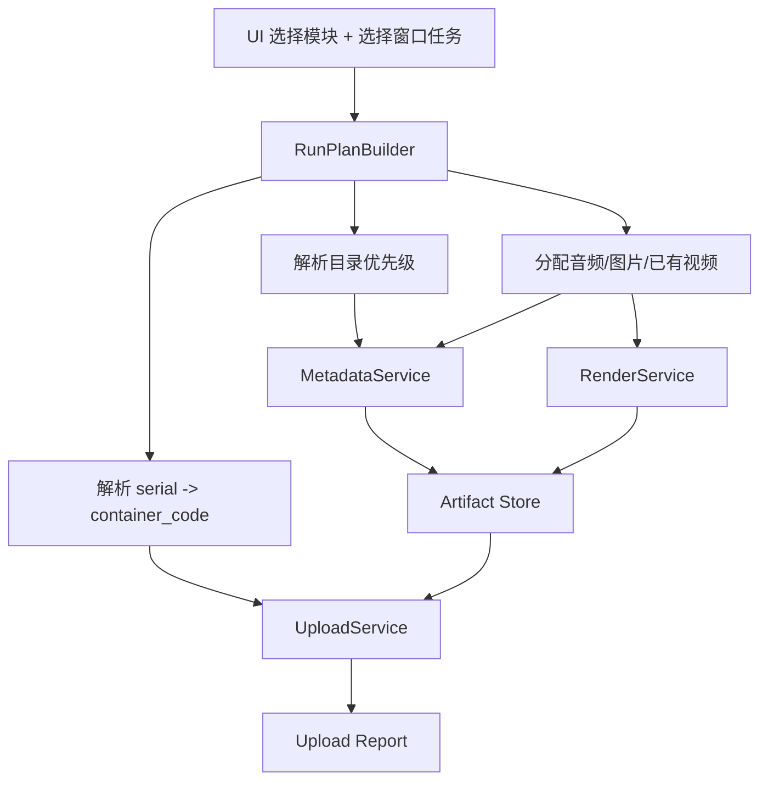

# YouTube 自动化整体逻辑重构审阅稿

## 1. 这份审阅稿的目标

这不是“继续在旧代码上打补丁”的方案，而是把当前仓库重新整理成一套可长期维护的主链。

目标只有 5 个：

1. 文案生成、剪辑、上传三块既能独立运行，也能组合运行。
2. 批量任务以“窗口任务”为核心，不再靠分组名和文件夹名强绑定。
3. 路径、状态、运行产物有单一来源，不再多处互相覆盖。
4. 上传链不再在运行中二次“猜”视频、缩略图、窗口和分类。
5. 后续加功能时，只新增模块，不再把一个文件继续堆到 3000 行以上。

## 2. 当前仓库的核心问题

### 2.1 主流程被拆散了，但没有真正解耦

当前主链分散在这些文件里：

- `dashboard_app.py`: UI、状态持久化、运行编排、命令拼接
- `workflow_core.py`: 路径解析、素材扫描、文案生成、缩略图生成、渲染、manifest 写入
- `batch_upload.py`: 环境解析、窗口计划、上传 UI 自动化、上传记录、各种 fallback
- `daily_scheduler.py`: 视觉特效、FFmpeg 渲染、历史清理

问题不是“文件多”，而是同一层逻辑重复出现。

例如：

- 路径选择在 UI 里有一份，在 `workflow_core.py` 里又有一份。
- 窗口/分组解析在 `dashboard_app.py`、`workflow_core.py`、`batch_upload.py`、`utils.py` 各有一部分。
- 上传要用哪些视频，本来应该在计划阶段定死，但现在上传阶段还会再次按 `tag/date/folder` 去猜。

### 2.2 当前系统没有真正的单一事实来源

现在实际参与主流程的状态文件至少有：

- `scheduler_config.json`
- `dashboard_state.json`
- `config/upload_config.json`
- `config/prompt_studio.json`
- `data/window_upload_plan_*.json`
- 每个输出目录里的 `upload_manifest.json`
- `generation_map.json`

问题是这些文件不是“层次化配置”，而是互相覆盖。

典型后果：

- UI 里选了新的分组和目录，但上传时仍然读旧 plan。
- 剪辑完后生成过一次文案，后续只上传时又被旧 manifest 或旧 generation_map 覆盖。
- 分组窗口能在 UI 里看到，但上传阶段又去重新查 tag 分组，查不到就整批失败。

### 2.3 “批量”本质上还不是任务驱动，而是标签驱动

当前很多逻辑还是默认：

- 一个 tag 对应一个项目目录
- 一个目录下的文件名要符合既定规则
- 上传时再按 tag 去找环境、找视频、找缩略图

这会导致批量一多就出问题：

- 任务数一多，素材和窗口之间的绑定关系开始漂移。
- 同一批次里 2 个窗口可能读到同一套标题/简介/缩略图。
- 只要分组接口、tag 名、文件夹名、manifest 任意一处不一致，上传链就会断。

### 2.4 UI 已经变成“功能面板集合”，但没有清晰的执行模型

现在 UI 已经有：

- 快捷开始
- 上传
- 提示词
- 当日内容
- 路径配置
- 高级视觉
- 日志

但执行时真正的心智模型并不清晰：

- 本次任务到底是谁定义的
- 本次运行读哪些目录
- 生成的文案落在哪
- 上传到底吃的是“刚生成的结果”还是“之前目录里的旧结果”

所以表面上是可视化，实际上还是很多隐式状态。

### 2.5 现有代码里已经出现明显的“补丁叠补丁”症状

当前仓库里可以明确看到这些风险：

- `dashboard_app.py` 中部分方法名重复出现，说明旧版和新版逻辑在同一类里叠加过。
- `batch_upload.py` 里存在多次重复定义的函数，说明后续 patch 只能靠“最后一个定义生效”。
- `utils.py`、`browser_api.py`、`batch_upload.py` 都在碰浏览器环境解析。
- `daily_scheduler.py` 和 `workflow_core.py` 同时承担渲染链职责。

这类结构短期能跑，长期一定会继续出现“修 A 坏 B”。

## 3. 重构后的目标执行模型

重构后，只保留一个核心概念：

**RunPlan（本次运行计划）**

所有模块都只围绕同一个计划工作。

### 3.1 统一执行入口

用户每次运行只做 3 件事：

1. 选择本次要执行哪些模块
2. 选择本次要处理哪些窗口任务
3. 点击开始

模块是：

- 文案生成
- 剪辑
- 上传

组合规则：

- 只勾选文案生成：只生成标题/简介/标签/缩略图
- 只勾选剪辑：只生成视频
- 只勾选上传：直接读取已有视频和已有文案上传
- 勾选文案生成 + 剪辑：生成文案，再剪辑视频
- 勾选剪辑 + 上传：剪辑完成后直接上传
- 三个都勾选：完整主流程

### 3.2 任务必须以“窗口任务”作为最小单位

以后不再让上传阶段靠 tag 去猜什么窗口。

每个任务都必须是明确的一行：

- `tag`
- `serial`
- `container_code`
- `channel_name`
- `source_override`
- `visibility`
- `category`
- `made_for_kids`
- `altered_content`
- `schedule`
- `ypp`

也就是说：

- 分组只是“帮你快速选窗口”的 UI 入口
- 真正进入运行链的是“窗口任务列表”
- 一旦 RunPlan 生成完，后面任何阶段都不再重新查分组来决定任务

### 3.3 路径解析只保留一套优先级

所有输入输出目录统一按这个顺序解析：

1. 当前窗口任务的临时目录覆盖
2. 当前分组绑定目录
3. 全局默认目录

不再允许：

- 上传阶段又按 `tag/date` 自己拼目录
- 剪辑阶段和上传阶段分别用不同目录解释规则
- 文件夹名必须等于分组名

也就是说，以后目录和分组**可以绑定，但不强绑定**。

### 3.4 上传链只能消费“显式产物”，不能再二次猜测

上传阶段以后只认这些已经定死的输入：

- `video_path`
- `title`
- `description`
- `tag_list`
- `thumbnail_path`
- `container_code`
- `serial`
- `upload_options`

上传阶段不再做这些事：

- 不再按 tag/date 再扫描视频目录
- 不再自己猜应该吃哪个 `generation_map.json`
- 不再自己猜缩略图来自哪个目录
- 不再因为分组 API 暂时失败就整批退出

### 3.5 文案生成必须对每个任务单独产出

以后元数据生成不能再以“分组一套”作为默认结果。

必须变成：

- 每个窗口任务一份 metadata
- 每个窗口任务一份 thumbnail
- 每个窗口任务一份 tag list

如果是批量：

- 批量只共享提示词模板和默认规则
- 不共享最终产出的标题、简介、缩略图文件

## 4. 重构后的模块边界

建议把主链拆成 6 层。

### 4.1 UI 层

文件建议：

- `ui/dashboard_app.py`

职责：

- 只负责表单、任务区、日志显示、运行状态显示
- 只把用户选择组装成 `RunRequest`
- 不再自己拼 batch_upload 命令，不再直接决定 fallback

### 4.2 Plan 层

文件建议：

- `core/run_plan.py`
- `core/task_resolver.py`

职责：

- 把 UI 输入转换成 `RunPlan`
- 解析窗口任务
- 解析目录优先级
- 绑定 `serial -> container_code`
- 分配每个任务的音频、图片、已有视频、已有 metadata

这是整个系统的单一事实来源。

### 4.3 Metadata 层

文件建议：

- `services/metadata_service.py`
- `services/prompt_service.py`

职责：

- 调提示词模板
- 生成标题/简介/标签
- 生成或复用缩略图
- 写入 `metadata_bundle.json`

输入是 `RunPlan.task`
输出是 `TaskArtifact.metadata`

### 4.4 Render 层

文件建议：

- `services/render_service.py`
- `services/effects_service.py`

职责：

- 消费明确的 `audio_path + image_path + visual_profile`
- 生成成品视频
- 记录渲染耗时和输出路径

Render 层只认明确素材，不再自己猜目录。

### 4.5 Upload 层

文件建议：

- `services/upload_service.py`
- `services/studio_automation.py`
- `services/browser_registry.py`

职责：

- 读取 `RunPlan` 里每个任务的上传输入
- 控制 BitBrowser / Studio
- 产出上传报告

Upload 层不再承担：

- tag 目录扫描
- 旧 manifest 兼容修复
- 文案生成

### 4.6 Artifact / State 层

文件建议：

- `state/settings_store.py`
- `state/run_store.py`

职责：

- 用户设置
- 分组绑定
- 模板绑定
- 运行计划
- 本次运行产物

这里要把“长期配置”和“本次运行状态”彻底分开。

## 5. 新的数据结构

### 5.1 长期设置

建议只保留两类长期设置：

#### Settings

- 全局目录
- 分组绑定目录
- FFmpeg
- 已用素材目录
- 上传后保留天数
- 默认时区
- 默认上传选项

#### Prompt Settings

- API 模板
- 内容模板
- 分组到模板的绑定

### 5.2 本次运行计划

建议新增统一文件：

- `data/runs/<run_id>/run_plan.json`

每次点击开始时生成。

内容包括：

- 本次选择的模块
- 运行日期
- 任务列表
- 每个任务解析出的输入输出目录
- 每个任务解析出的窗口容器信息
- 每个任务的上传默认项和覆盖项

### 5.3 本次运行产物

建议固定到：

- `data/runs/<run_id>/artifacts/`

包含：

- `metadata/<serial>.json`
- `thumbnails/<serial>.png`
- `videos/<serial>.mp4`
- `upload_manifest.json`
- `upload_report.json`

这样以后上传阶段只认这一个运行目录，不再跨目录找老文件。

## 6. 推荐的新执行流程

关键规则：

- 文案生成完成后，结果写入本次运行目录
- 剪辑完成后，视频写入本次运行目录
- 上传阶段只读本次运行目录
- 不再回头去翻全局目录找旧数据

## 7. UI 重构建议

### 7.1 快捷开始页

只保留：

- 模块勾选
- 日期
- 模拟时长
- 预览计划
- 路径检查
- 开始执行

不再放过多业务参数。

### 7.2 上传页

上传页只负责：

- 选分组
- 点窗口加入任务区
- 设置默认上传规则
- 设置单窗口覆盖

上传页不再自己决定路径解析规则。

### 7.3 路径页

路径页只负责：

- 文案输出目录
- 音乐目录
- 底图目录
- 成品视频输出目录
- FFmpeg
- 已用素材目录
- 上传后保留天数
- 分组绑定目录

不再混入上传任务逻辑。

### 7.4 提示词页

提示词页只负责模板，不直接参与运行状态。

### 7.5 当日内容页

建议弱化为“审稿页”。

它不再是运行链核心输入，而是：

- 查看
- 手动修
- 回写 metadata artifact

## 8. 批量逻辑的正确做法

### 8.1 音频、图片、窗口数量不一致时

统一规则：

- 可执行任务数 = `min(窗口任务数, 可分配音频数, 可分配图片数)`（剪辑场景）
- 只上传场景 = `min(窗口任务数, 已有视频数)`（上传场景）

### 8.2 分配原则

每个任务都必须拿到一个明确的：

- `audio_path`
- `image_path`
- `video_path`
- `metadata_path`

不是运行时临时去猜，而是在计划阶段就分好。

### 8.3 已用素材处理

建议统一在 `RunCoordinator` 收尾阶段处理：

- 成功渲染并上传完成的源音频/源图片 -> 移入已用素材目录
- metadata 结果 -> 留在 artifact 目录
- 已上传视频 -> 按保留天数清理

## 9. 迁移实施顺序

建议分 4 步做，不要一次性全重写。

### 第 1 步：先冻结数据结构

先定：

- `RunPlan`
- `TaskArtifact`
- `Settings`

不先碰 UI。

### 第 2 步：把目录解析和窗口解析抽出来

优先抽出：

- 路径优先级解析
- 分组绑定
- `serial -> container_code`
- 任务素材分配

只要这一层稳了，后面一半问题会消失。

### 第 3 步：把 metadata / render / upload 变成三个纯服务

每个服务只接收明确输入，输出明确 artifact。

### 第 4 步：让 UI 只消费新服务

最后再把 `dashboard_app.py` 改成只负责调用服务和显示状态。

## 10. 我建议保留 / 删除的文件方向

### 建议保留并重构

- `dashboard_app.py`
- `workflow_core.py`
- `batch_upload.py`
- `content_generation.py`
- `browser_api.py`
- `prompt_studio.py`
- `effects_library.py`

### 建议逐步下沉或拆分

- `daily_scheduler.py`
- `utils.py`
- `upload_window_planner.py`
- `group_upload_workflow.py`

### 不建议继续做大的功能叠加

- 在 `batch_upload.py` 继续加更多 fallback
- 在 `dashboard_app.py` 继续塞更多业务状态
- 在 `workflow_core.py` 继续增加“又生成又渲染又上传”的隐式逻辑

## 11. 审阅结论

我建议后续重构按这个目标推进：

### 核心结论

1. 以后系统只认 `RunPlan`，不再认“运行时重新扫描 tag 目录”。
2. 分组只是 UI 入口，真正执行的是“窗口任务列表”。
3. 上传阶段只吃显式 artifact，不再二次猜目录、猜缩略图、猜视频。
4. 路径优先级必须固定成“任务覆盖 > 分组绑定 > 全局默认”。
5. 文案、剪辑、上传三块必须变成独立服务，而不是继续互相穿透。

### 我建议你这次先审的重点

1. 这个目标架构你认不认可。
2. 路径优先级和分组绑定规则你认不认可。
3. 批量逻辑是否按“任务最小单位 = 窗口任务”来彻底统一。
4. 是否接受我下一步按“先抽 RunPlan 和任务解析层，再收 UI”的顺序实施。

